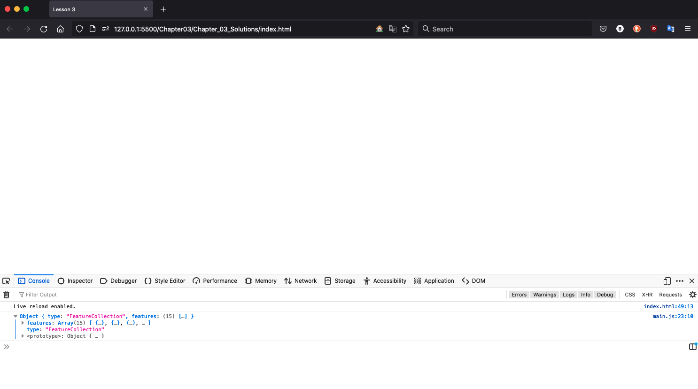
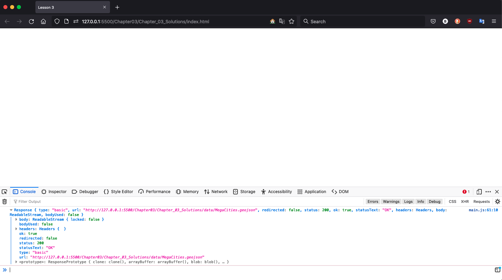
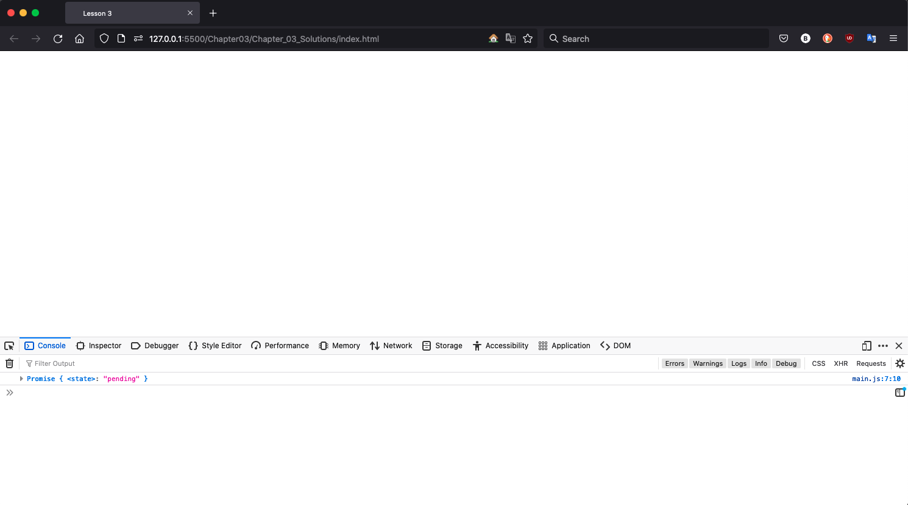
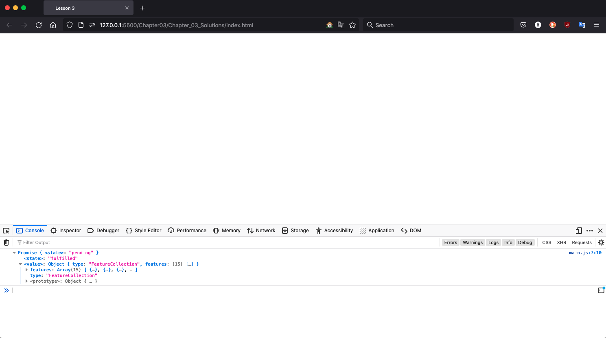

### [Return Home](../../../) | [Previous Chapter](../Chapter02) | [Next Chapter](../Chapter04)

Chapter 3: Data and AJAX
=======================

Chapter 3 is all about data, inching us one step closer to making your first interactive web map in the next chapter! Chapter 3 includes three lab lessons and ends with Activity 4, a second debugging exercise to continue to practice your computational thinking skills.

*   In Lesson 1, we introduce common web data formats and their geospatial variants.
*   In Lesson 2, we introduce AJAX (Asynchronous JavaScript and XML) and Fetch, or the strategy used to load data dynamically into the browser, enabling interactivity with maps and visualizations.
*   In Lesson 3, we demonstrate how to employ `fetch()` requests through callback functions.

After this chapter, you should be able to:

*   Correctly format geospatial data in CSV and JSON formats
*   Write an AJAX call to retrieve data using the `fetch()` method
*   Write an AJAX callback function that adds data to the DOM

Lesson 1: (Geo)Web Data Formats
-------------------------------

### I. Geospatial Data

**_Geospatial data_** are explicitly referenced to a coordinate system representing the Earth's surface. Geospatial data can be in a _**vector**_ (representing "objects" as combinations of coordinate nodes and arcs between nodes) or _**raster**_ (representing a "field" as a regularly-spaced lattice or grid) format. Spatial often is described as "special" because spatial topology is meaningful, with near features more likely to be similar than distant features. 

Geospatial data therefore cannot be treated as simple X,Y or Cartesian coordinates, but instead need to be [projected](https://gistbok.ucgis.org/bok-topics/map-projections) onto a distorted, flat surface of the otherwise three-dimensional Earth. As we discuss later in the semester when introducing non-spatial data formats and their associated visualization techniques, the importance of coordinate systems, spatial typology, and projections makes maps perhaps the most difficult form of information visualization (i.e., _cartographers typically can design non-map visualizations--directly porting what they know about map design to other visuals--but data scientists without spatial training often need to acquire additional knowledge or risk making ineffective maps_!). 

When making static maps, we rely primarily on **_shapefiles_** (extension **_.shp_**), a very common geospatial format developed by Esri for its proprietary products. Shapefiles are not optimized for the web, as they comprise multiple files of different formats (e.g., .prj, .dbf), some that can be read by a text editor (and therefore web browser) and others that cannot. Thus, the first step in web mapping often is converting shapefiles into a simpler web format (details below).

There are a number of options of web data formats that can be used for interactive maps. For instance, _**KML** (**Keyhold Markup Language**_) is an extension of _**XML**_ (_**eXtensible Markup Language**_) popularized by Google for its Google Earth and Google Maps APIs. While XML remains popular on the web (it is the X in AJAX, as introduced below!), contemporary web mapping is shifting to JSON-based formats (introduced below) that are more easily interpreted through the DOM. In Lesson 1, we first introduce CSV data, perhaps the simplest form of geospatial data that is acceptable for mapping vector points, and then discuss the more complex JSON-based formats used for mapping lines and polygons.

If you are not familiar with geospatial data, we recommend reading background on common [vector](https://gistbok.ucgis.org/bok-topics/vector-formats-and-sources) and [raster](https://gistbok.ucgis.org/bok-topics/raster-formats-and-sources) formats. We primarily use vector formats in this workbook, but will load raster tilesets as basemaps in Unit 2.

### II. CSV Data

_**CSV**_ (extension .csv) stands for _**comma-separated values**_. Like the name implies, a CSV is a matrix of values with a header row. Values are separated by commas along the horizontal axis and by invisible newline characters at the end of the row. Thus, CSVs typically are viewed in spreadsheet form, and can be created and edited through Microsoft Excel, Google Sheets, or other spreadsheet software.

Say you want to tell a story about the growth of the world's largest cities. You can start by building a CSV spreadsheet of the top cities and their populations (Figure 1.1):

###### Figure 1.1: A correctly formatted spreadsheet table (Source: United Nations)

Each geographic feature (a city) occupies one row, and the attribute data (population) is stored in a column or field, just as in the attribute table of a shapefile.

If we want to tell a story about urban _growth_, we need more than one population data capture for each city. The expanded spreadsheet includes the urban populations at five-year time intervals from 1985 to 2015 (Figure 1.2). 

###### Figure 1.2: A CSV with multiple sequential, numeric attributes (Source: United Nations)

The Figure 1.2 spreadsheet is just attributes and does not yet contain geospatial coordinates. Given the world scale of the map, each city should be represented as a point at its geographic center. You can use an internet search engine to find latitude and longitude values for each feature, but a faster and easier way to do so is to use a **_batch geocoder_**. Figure 1.3 uses the [Local Focus](https://geocode.localfocus.nl/) batch geocoder, one in a number of options available online. Leave "country" set to Worldwide, and simply copy the first column of your spreadsheet and paste it into the input box. Hit "Add to Geocoder" and see your results below.

###### Figure 1.3: The Local Focus Geocoder: https://geocode.localfocus.nl/

The Local Focus geocoder attempts to disambiguate all text strings into geographic coordinates. Some names may produce multiple coordinates, with Local Focus allowing you to select the correct location. You also can flag incorrectly geocoded coordinates using the "X" button and manually add the coordinates to your CSV later based on an internet search. Notice that the interactive map displaying the results is built with Leaflet, the Javascript library we will start learning next chapter! Importantly, set your text results to "Decimals with dots", copy the final results, and paste them into a spreadsheet.

###### Figure 1.4: Results from the geocoder

The geocoded output includes _**latitude**_ (the "Y" value north and south from the equator) and _**longitude**_ (the "X" value east and west from the prime meridian in Greenwich) columns. Many programs and websites recognize CSV data as geospatial if it contains these two column headers, so it is a good idea to always use these names for your coordinate columns. Note that the coordinate values are in **_decimal degrees_**, with positive values denoting north latitude or east longitude and negatives denoting south/west.

Your final spreadsheet should have the name, lat/long coordinates, and population data for each city (Figure 1.5)  Once the spreadsheet is ready, save it using the ._csv_ option to your _Chapter03_ _data_ folder (within your _unit-1_ repository). _Note_: Choose "UTF-8" for the character encoding when saving to ensure all characters are universally recognized.

Additionally, copy the contents from _Chapter02_ to _Chapter03_. Doing so will allow you to access everything that you copied from _boilerplate_ to _Chapter02_, as well as build on the script that you began writing in Chapter 2.

###### Figure 1.5: Georeferenced data

> **Open _MegaCities.csv_ located in _Chapter03_ of the _unit-1_ folder. Run its contents through a batch geocoder to add latitude and longitude columns. Fill in any missing coordinate values.**

### II. JSON and GeoJSON

_**JSON**_, or _**JavaScript Object Notation**_, is an alternative data format native to JavaScript and the Open Web that stores data as one long JavaScript object for referencing and manipulation in the DOM. JSON keys are strings and the values may be strings, numbers, arrays, or other objects.

_**GeoJSON**_ was invented to take advantage of JSON syntax for geospatial data. GeoJSON is to JSON as KML is to XML; while JSON may use any arbitrary keys and values, the GeoJSON specification requires particular keys and data types. Like a shapefile, GeoJSON uses a spaghetti model for geometry, with no topology or shared polygon boundaries (more about this when we introduce TopoJSON for D3 in Chapter 8).

You can manually convert a CSV or KML to GeoJSON using [geojson.io](http://geojson.io/) or programmatically using the [`csv2geojson()` method](https://github.com/mapbox/csv2geojson) during the execution of your script. You can convert shapefiles to GeoJSON using the [MapShaper tool](https://mapshaper.org/). Starting with manual conversation with geojson.io, upload your dataset by dragging the file into the browser. If it is correctly formatted, the application will recognize the geography instantly and display a point marker for each city (Figure 1.6).

###### Figure 1.6: MegaCities.csv displayed in geojson.io

Note that data appears in GeoJSON format in the right-side panel. There are no variables defined here, just the JSON object beginning with an opening curly brace on the first line. The first key is `"type"`, which has the value `"FeatureCollection"`; this indicates the data is a GeoJSON. There then is an array of `"features"`, each with its own object with a `"type"` (`"Feature"`), an object called `"properties"` containing the feature attributes, and a `"geometry"` object with the geometry `"type"` (`"Point"`) and a two-value `"coordinates"` array. Note that longitude comes before latitude in this array, following the \[x, y, z\] geometry convention (the optional z value is used to represent elevation). Familiarize yourself with this formatting, as we use it repeatedly in this workbook and it is increasingly standard across web mapping.

Once you have imported your data, you have two options for saving it as a GeoJSON file. If you want to keep the data neatly formatted as it is in the side panel, you can simply select all of the text in the side panel, copy it, paste into a new blank file in your text editor, and save it with a _.geojson_ extension from there. For a minified file, use the Save menu in the upper-left corner of the map and choose "GeoJSON". A file called _map.geojson_ will download automatically; retrieve this file from your downloads folder, move it to the data folder in your website directory, and rename it appropriately.

> ### **Use [geojson.io](http://geojson.io/) to convert your CSV to a GeoJSON. Save your GeoJSON file to your _data_ folder in your _Chapter03_ subdirectory. We use the file named _MegaCities.geojson_ in the Lesson 2 example.**

Lesson 2: AJAX Concepts and Syntax
----------------------------------

### I. What is AJAX?

_**AJAX**_ Stands for **_Asynchronous JavaScript and XML_**. Back in the Internet Stone Age (the 1990s), webpages were static. Any changes in content required the user to reload the web page. For instance, when MapQuest was invented, in order to pan the map from side to side, the user had to click an arrow button that would reload the entire webpage with a new section of map then shown on the reloaded page.

AJAX is the reason we can have a fluid rather than fragmented user experience, allowing data to be sent to and received from a server _asynchronously_ without reloading the webpage. AJAX enables interaction, as asynchronous data requests are executed through event listeners on interactive controls within the webpage, such as buttons, sliders, form fill-in textboxes, or the map and individual map features themselves.

### II. Fetch Requests

JavaScript AJAX requests are somewhat complicated; they involve an entire back-and-forth conversation between the client and the server. To make AJAX requests, you will use Javacript's native _**Fetch**_ API. Although you ultimately will use a highly simplifed form of the [`fetch()` method](https://developer.mozilla.org/en-US/docs/Web/API/fetch) for you AJAX calls (see Lesson 3), it is conceptually useful to step through a full Fetch request to gain an understanding of how AJAX works.

Start by creating a simple request for the data in your converted _MegaCities.geojson_ file (Example 2.1). The statement `new Request()` creates a new instance of a special type of object, assigned to the `request` variable, that communicates with a server to retrieve or send data asynchronously (i.e., without reloading the webpage).

###### Example 2.1: Declaring and assigning a new data `request` object in _main.js_

    function jsAjax(){
        // Step 1: Define the data request
        var request = new Request('data/MegaCities.geojson');
    };

    window.onload = jsAjax();

We then declare a second variable, here named `init`, to define the type of Fetch request using the `method` property of the `request` object: either `'GET'` for retrieving data from the server or `'POST'` for sending data to the server. Example 2.2 uses `GET` get load the data in the _MegaCities.geojson_ file into the browser.

###### Example 2.2: Defining the `method' property in _main.js_

    function jsAjax(){
        // Step 1: Create the data request 
        var request = new Request('data/MegaCities.geojson');
        //Step 2: define Fetch parameters 
        var init = {
            method: 'GET'
        }
    };

    window.onload = jsAjax();

We then trigger the Fetch request using the `fetch()` method passing the `request` and `init` variables as parameters (Example 2.3). Note that the `init` parameter is optional for our purposes, as `'GET'` is the default `method` property of the `request` object.

###### Example 2.3: Creating a AJAX request using `fetch()` in _main.js_

    function jsAjax(){
        // Step 1: Create the data request 
        var request = new Request('data/MegaCities.geojson');
        //Step 2: define Fetch parameters 
        var init = {
            method: 'GET'
        }
        //Step 3: use Fetch to retrieve the data
        fetch(request, init)
    };

    window.onload = jsAjax();

The `fetch()` method accesses the server at the location defined in the `request` variable using the properties stored in the `init` variable. In this case, the data are being retrieved from the _data_ folder of your boilerplate web directory. 

The final step is to send the received data to a callback function that it can be accessed in other areas of your script to support map rendering and interaction. A JavaScript _**callback function**_ executes script that uses the data retrieved from a server after the data is completely loaded into the browser. Consequently, any script that makes use of data sent through AJAX should be written or called within the `callback()` function to avoid manipulating the data before it is fully available in the browser (Example 2.4). 

###### Example 2.4: Adding a `callback()` function to a `fetch()` request in _main.js_

    function jsAjax(){
        // Step 1: Create the data request 
        var request = new Request('data/MegaCities.geojson');
        //Step 2: define Fetch parameters 
        var init = {
            method: 'GET'
        }
        //Step 3: use Fetch to retrieve data
        fetch(request, init)
            .then(callback) //Step 4 Send retrieved data to a callback function
    };

    //define callback function
    function callback(response){
        //tasks using the data go here
        console.log(response)
    }

    window.onload = jsAjax();

The `.then()` method fires the `callback()` function after, and only after, the data have been retrieved from the server. `then()` methods can be chained together, so that a series of functions calls one after the other. 

While Example 2.4 will run successfully, it is actually missing a crucial step: converting the retrieved data into a readable format for subsequent use. To do this, add a new `.then()` method and callback between the `fetch()` and our current callback, and reassign the order of our steps (Example 2.5). We will discuss why this is necessary in Lessson 3.  

###### Example 2.5: Adding a `conversion()` function to convert the returned `fetch()' request data in _main.js_

    function jsAjax(){
        // Step 1: Create the data request 
        var request = new Request('data/MegaCities.geojson');
        //Step 2: define Fetch parameters 
        var init = {
            method: 'GET'
        }
        //Step 3: use Fetch to retrieve data
        fetch(request, init)
            .then(conversion) //Step 4 convert data to usable form
            .then(callback) //Step 5 Send retrieved data to a callback function
    };

    //define conversion callback function
    function conversion(response){
	  //convert data to usable form
	  return response.json();
    }

    //define callback function
    function callback(response){
        //tasks using the data go here
        console.log(response)
    }

    window.onload = jsAjax();

In the `conversion()` function, we convert the data using the `.json()` method.

From the Codecademy tutorials in Activity 2, you know that you can pass data into a function through the parameters and then return data for storage in a variable using the `return` reserved word. In Example 2.5, we return the converted data, which then passes to our second `callback()` function as the `response` variable, where it can be used. To review, data are retrieved from the server in Steps 1-3. After (and only after) they are retrieved, the data are sent to the `conversion` function in Step 4. After (and only after) the data are converted, they are finally sent to the `callback` function in a usable form.  

If the `fetch()` request executes successfully, the `callback()` function will print the _MegaCitites.geojson_ object to the console (Figure 2.1).

###### Figure 2.1: The console showing the _MegaCitites.geojson_ object

We also can view the response as plain text using JavaScript's built-in JSON library to translate the _MegaCitites.geojson_ object to a string (Example 2.6; Figure 2.2).

###### Example 2.6: Translating the _MegaCitites.geojson_ object to a string in _main.js_

        //Example 2.5 line 23...
        console.log(JSON.stringify(response));

###### Figure 2.2: The console showing the _MegaCitites.geojson_ object as a string

 

### III. Simplifying Fetch Requests

The full `fetch()` request in Example 2.6 is awfully long, and much of it can be greatly simplified now that you know how it works. 

To start, the `request` object can be defined in the `fetch()` method itself and you do not need to specify any properties though the `init` variable since `GET` is the default (Example 2.7).

###### Example 2.7: Simplifying the `fetch()` request in _main.js_

    //Example 2.5 line 1
    function jsAjax(){
        //use Fetch to retrieve data
        fetch('data/MegaCities.geojson')
            .then(conversion) //convert data to usable form
            .then(callback) //send retrieved data to a callback function
    };

    //define conversion callback function
    function conversion(response){
	  //convert data to usable form
	  return response.json();
    }

    //define callback function
    function callback(response){
        //tasks using the data go here
        console.log(response)
    }

    window.onload = jsAjax();

The function for data conversion also is unnecessarily long, and can be added directly as an anynomous function to the `.then()` method (Example 2.8).

###### Example 2.8: Simplifying the `conversion()` request with shorthand in _main.js_

    //Example 2.7 line 1
    function jsAjax(){
        //use Fetch to retrieve data
        fetch('data/MegaCities.geojson')
            .then(function(response){
                return response.json();
            }) 
            .then(callback) 
    };

    //define callback function
    function callback(response){
        //tasks using the data go here
        console.log(response)
    }

    window.onload = jsAjax();

> ### **Examine the API Documentation for the [`fetch()`](https://developer.mozilla.org/en-US/docs/Web/API/fetch) method to determine the purpose each property serves. Then, write a script using a `fetch()` request that prints _MegaCities.geojson_ file to the console in _main.js_.**

Note that regardless of the `method` used for `fetch()`, there always is a URL string that points to the data location and at least one callback function specified within the parameters. The purpose served by the URL string should be obvious—find the data we want—but the callback function may be trickier to fully understand. Next, we examine the reason for both callback functions in the `fetch()` request and describe how to debug the callback function in your script.

Lesson 3: Understanding AJAX Callback Functions
-----------------------------------------------

What would happen, for example, if instead of converting the data as we did in Example 2.5, we simply logged the response from the first callback (Example 3.1). 

###### Example 3.1: Viewing fetched data without converting in _main.js_

        function jsAjax(){
            fetch('data/MegaCities.geojson')
                .then(callback) 
        };

        function callback(response){
            console.log(response)
        }

        window.onload = jsAjax();

Instead of our JSON data, the `fetch()` request returns a full [`response`](https://developer.mozilla.org/en-US/docs/Web/API/Response) object. While this object tells us some interesting things about the status of our request, it is not actually usable until we parse it (Example 3.1). 

###### Figure 3.1: The DOM tab showing properties of the `response` object

However, if we simply try to parse the data in the same callback function using `json()`, we will get a strange result (Example 3.2; Figure 3.2).

###### Example 3.2: Attempting to print the response data to the console in _main.js_

    //Example 3.1 line 7...
    console.log(response.json());
    

###### Figure 3.2: What is a `promise` and why is it pending?

Why is our `response` listed as a `promise`? Since we are using `fetch()`, we request the data to be sent _asynchronously_. Accordingly, the browser interpreter continues executing the rest of the script while the server takes a few milliseconds to gather and send the requested data. Thus, when our `console.log` statement is executed to print the contents of `response`, the data have not arrived yet! Instead, they are stored in a type of object called a _**`promise`**_, which acts a placeholder for asynchronously loaded data. Promises have three `states` that indicate the status of the data. `pending`: the data are stil being loaded; `fulfilled`: the data have completed loading; and `rejected`: for some reason, the data cannot load. 

If we uncollapse the promise, we will see that eventually it was fulfilled, but only _after_ the `console.log` request (Figure 3.3).

###### Figure 3.3: The uncollapsed promise

Consequently, any script that makes use of data retrieved through `fetch()` needs to be converted before it is brought into the final callback function. Example 3.3 again shows the correct `fetch()` solution including the additional callback function from Example 2.8 (Example 3.3).

###### Example 3.3: Correctly accessing the `response` using a `callback()` function in _main.js_

    //Example 3.1...
    //define fetch request
    function jsAjax(){
        //basic fetch
        fetch('data/MegaCities.geojson')
            .then(function(response){
                return response.json();
            }) 
            .then(callback) 
    };

    //define callback function
    function callback(response){

        //tasks using the data go here
        console.log(response)

    }

    window.onload = jsAjax();

Note that the `fetch()` function itself _also_ resturns a promise, and is only `fufilled` when the data have been successfully retrieved from the server. When the `fetch` has been `fufilled`, it uses the `then()` method to trigger the `conversion()` callback function. The data then are converted using `json()`, and once this conversion is complete (and the promise is `fulfilled`), the final `callback` function is tiggered. Finally, the data can be used!

Any other functions you call from within the final callback function can access the loaded data if you pass it as a parameter in the function call (Example 3.4).

###### Example 3.4: Calling a new function called `nextFunction()` from within the `callback()` function in _main.js_

     //Example 3.3 Line 10...
    //define callback function
    function callback(response){
    
        var myData = response;
    
        //pass data to another function
        nextFunction(myData);
    };
    
    function nextFunction(data){
    
        console.log(data); //contains response data held by myData in callback
    };
    

You can use an anonymous function as a callback instead of defining the function separately. However, data returned by the server only is available for operations that take place within the anonymous function or other functions called from the anonymous function that have the data passed as a parameter. For instance, what is wrong with Example 3.5?

###### Example 3.5: An anonymous callback function in _main.js_

    function jsAjax(){
        //define a variable to hold the data
        var myData;
        
        //basic fetch
        fetch('data/MegaCities.geojson')
            .then(function(response){
                return response.json();
            }) 
            .then(function(response){
                myData = response;
            }) 
        
        //check the data
        console.log(myData)
    };

    document.addEventListener('DOMContentLoaded',jsAjax)
    

If you copy this script to your _main.js_ file and preview in Prepros or local server, you will see that `myData` on Line 15 is undefined. Even though we correctly created our variable at the top of the function and assigned the data to it within the `fetch()` anonymous callback function, the data is not available to us on Line 15 because that line was executed by the interpreter _before_ the data arrived and was assigned to the variable.

Adding another `console.log()` statement inside of the callback shows the that `myData` is available within the anonymous function, but undefined outside the anonymous function (Example 3.6; Figure 3.4).

###### Example 3.6: Attempting to print the data to the console within and outside of the `callback()` function in _main.js_

    //Example 3.5...
    function jsAjax(){
        //define a variable to hold the data
        var myData;
        
        //basic fetch
        fetch('data/MegaCities.geojson')
            .then(function(response){
                return response.json();
            }) 
            .then(function(response){
                myData = response;

                //check the data
                console.log(myData)
            }) 
        
        //check the data
        console.log(myData)
    };
    

###### Figure 3.4: The console showing attempts to access data outside of and within the callback

Note that the `console.log()` statement on Line 18 of Example 3.6 is executed _first_ and is undefined. The statement on Line 14 is executed within the callback, so only after the data has been received and assigned to `myData`.

> ### **Add at at least two `console.log()` statements _with comments_ to your AJAX script indicating where your data can and cannot be accessed.**

## Activity 4

1.  Debug the [_debug\_ajax.js_](debug_ajax.js "debug_ajax.js") script included in the _**Chapter03**_ repo. Copy and paste its contents into your _main.js_ file after the existing script from Chapter 2, then add function calls and debug it to make it work with the rest of your script. Add comments explaining what the script is doing at each step. Your script should result in something that looks similar to this in the browser:  
    
    
    
2.  Commit your changes to your _unit-1_ Git repository and sync with GitHub. 

_This work is licensed under a [Creative Commons Attribution 4.0 International License](http://creativecommons.org/licenses/by/4.0/).   For more information, please contact Robert E. Roth \(reroth@wisc.edu\)._

### [Return Home](../../../) | [Previous Chapter](../Chapter02) | [Next Chapter](../Chapter04)
